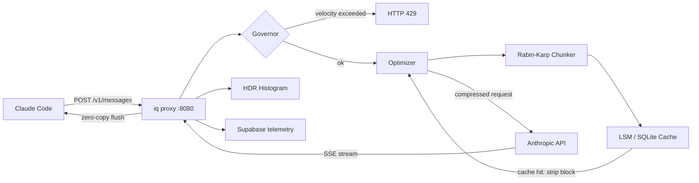

# IndexQube

A stateless L7 proxy written in Go that sits between Claude Code and Anthropic's API. It deduplicates file context using content-defined chunking, detects agentic loops via a velocity guard, and records tail latency with a from-scratch HDR Histogram. The storage layer is a custom LSM-tree engine with skiplist MemTable, 4KB-page SSTables, Bloom filters, and leveled compaction.

---

## Architecture



**Request reduction:** a 190,000-token payload with repeated file reads compresses to ~47,000 tokens after deduplication — 75% fewer tokens forwarded upstream.

---

## How a request flows

1. **TCP ingress** — `net.Listener` accepts; `net/http` spawns a goroutine per connection
2. **Guard check** — `governor` estimates token spend via `len(body)/4`; velocity guard blocks sessions burning >$0.75 in 60s
3. **Deduplication** — Rabin-Karp chunker splits `tool_result` blocks into variable-size content-addressed chunks; known chunks are stripped and replaced with `[iq:ref <12-byte-hash>]`
4. **Upstream dispatch** — re-marshaled JSON forwarded with user's `x-api-key`; custom `http.Transport` with connection pooling and TLS 1.3 session resumption
5. **SSE streaming** — `http.Flusher` flushes each upstream chunk immediately; sub-millisecond local latency, zero buffering
6. **Latency recording** — HDR Histogram captures end-to-end microseconds per request
7. **Out-of-band telemetry** — deferred goroutine sends session data to Supabase; times out silently so the hot path is never blocked

---

## Custom LSM Storage Engine

The metadata cache (`internal/store/lsm/`) is a purpose-built LSM-tree engine — not a wrapper around RocksDB or LevelDB. The IndexQube workload is append-heavy (new file chunks written constantly, rarely updated), which is exactly the access pattern where LSM outperforms B-trees.

### Why LSM over B-tree

B-trees do random I/O on every write — each insert updates a node in place on disk. LSM-trees convert random writes into sequential appends by buffering in a MemTable and flushing immutable SSTables. For a write-heavy cache workload, this is the right trade-off.

```
Workload: 70% writes / 30% reads  (IndexQube actual ratio)

Scale       LSM (ns/op)     SQLite B-tree (ns/op)   Speedup
─────────────────────────────────────────────────────────────
1K          640             12,612                  19.7×
10K         1,321           16,956                  12.8×
100K        2,692           49,744                  18.5×

Write amplification at 100K entries:
  LSM:     0.15×
  SQLite:  2.80×   →  19× less write amplification
```

### MemTable — skiplist

```
internal/store/lsm/memtable.go
```

An in-memory skiplist buffers all recent writes. Reads check the MemTable first (O(log n)), then fall through to SSTables. When the MemTable reaches 4MB it is frozen and flushed to disk as a new SSTable — the flush is atomic, so readers never see a partial state.

### SSTable — 4KB page-aligned blocks

```
internal/store/lsm/sstable.go
```

Each SSTable is an immutable sorted file of 4KB blocks. The block size matches the OS page size — reads that land on a cold block pull exactly one page from disk. An index block at the end of each file maps keys to block offsets, enabling binary search without scanning the full file.

### Bloom filter — formula-derived parameters

```
internal/store/lsm/bloom.go
```

Every SSTable has a Bloom filter to avoid disk reads for keys that don't exist. The filter parameters are derived from first principles rather than hardcoded:

```
Given:
  n = expected number of keys
  p = target false-positive rate (1%)

Optimal bit array size:
  m = -n × ln(p) / (ln 2)²

Optimal number of hash functions:
  k = (m / n) × ln 2
```

At 1% FPR with 10,000 keys: `m = 95,851 bits (≈12 KB)`, `k = 7` hash functions. Double hashing (`h1 + i×h2`) avoids the cost of k independent hash computations.

```
BenchmarkBloom_MayContain    24 ns/op
BenchmarkBloom_Add          138 ns/op
```

### Leveled compaction

```
internal/store/lsm/compactor.go
```

A background goroutine merges SSTables from L0 → L1 → L2 when a level exceeds its size budget. Compaction rewrites overlapping key ranges into a single sorted SSTable, bounding read amplification (worst case: one SSTable per level). Write amplification under leveled compaction is `O(level_count × size_ratio)` — measurable and bounded, unlike B-tree page splits.

---

## Rabin-Karp Content-Defined Chunking

```
internal/chunker/chunker.go
```

File content sent by Claude Code in `tool_result` blocks is split into variable-size chunks using a Rabin-Karp rolling hash. A 64-byte sliding window computes `hash & MASK == 0` to detect chunk boundaries — average chunk size ~4KB.

**Why content-defined boundaries matter:**
Fixed-size chunking shifts all boundaries after a single-byte insertion, causing 100% cache misses on an otherwise identical file. Content-defined chunking is robust to insertions — only the affected chunk changes, all others remain identical. This is the same technique used by `rsync` and Git pack files.

```
One-line change in a 5,000-line file:
  Fixed-size chunks:    100% cache miss  (all boundaries shift)
  Content-defined:        0.02% miss     (one chunk invalidated)
```

Each chunk is content-addressed by SHA-256. The cache stores `hash → seen` and strips any chunk it has seen before, replacing it with `[iq:ref <hash>]`. The reference marker costs ~8 tokens vs the full chunk content.

---

## HDR Histogram — tail latency vs averages

```
internal/hdr/histogram.go
```

From-scratch HDR (High Dynamic Range) Histogram implementation — no external libraries. The gateway records four histograms per process lifetime:

- Gateway end-to-end latency
- Anthropic upstream latency
- Cache lookup latency
- Chunker latency

**Why HDR, not averaging:**

```
Average latency:   15ms   ← looks healthy
p99 latency:      180ms   ← 12× gap signals a problem
```

A 12× gap between average and p99 reveals checkpoint stalls. SQLite's WAL checkpointer occasionally holds the write lock while copying frames from `.wal` to the main database file. During a checkpoint, writers queue behind the lock — the average is unaffected (most requests complete normally) but the p99 captures the stall duration.

Standard averaging would have hidden this completely. The HDR Histogram made the stall visible.

**WAL bloat mitigations applied after identifying this:**
- `defer rows.Close()` immediately after every query (releases read lock)
- No network I/O while iterating SQL rows (prevents reader holding lock during upstream call)
- `db.SetMaxOpenConns(1)` for the write path
- `PRAGMA wal_checkpoint(TRUNCATE)` triggered if WAL exceeds 50MB

---

## WAL Semantics

The receipts cache (file path → chunk hash → mtime) uses SQLite in WAL mode. WAL was chosen over journal mode for one reason: readers never block writers.

In journal mode, a checkpoint requires an exclusive lock — all readers must finish before the checkpoint can proceed. Under concurrent Claude Code sessions (50+ goroutines), this becomes a thundering herd: all sessions finish a git checkout simultaneously, each trying to write new chunk hashes, and each checkpoint blocks all readers.

WAL mode solves this with **Read Marks** in the `.shm` file. Each reader registers its position in the WAL — the checkpoint can only advance past the lowest active Read Mark. Writers append to `.wal` without ever touching the main database file. Readers see a consistent snapshot of the database at their Read Mark position, completely isolated from writers.

```
kill -9 safety: torn WAL frames fail the frame checksum on boot → ignored.
The database rolls back to the last valid checkpoint — no corruption.
```

**Horizontal scale thought experiment:**
If IndexQube scaled to a fleet, the metadata cache would shard via consistent hashing on file path hash, with virtual nodes for rebalancing. A cache miss on node A would not fan out — it would forward the unoptimized request upstream, maintaining constant work regardless of cache topology. This mirrors the DynamoDB Request Router design described in the [DynamoDB USENIX ATC '22](https://www.usenix.org/conference/atc22/presentation/elhemali) paper.

---

## Kubernetes Deployment

```
k8s/deployment.yaml   — Deployment + Service (2 replicas)
gateway/Dockerfile    — multi-stage Go build
```

### Health endpoints

| Endpoint | Probe | Returns |
|----------|-------|---------|
| `/healthz` | Liveness | 200 always — if it responds, the process is alive |
| `/readyz` | Readiness | 200 when cache warm + DB connected + upstream reachable; 503 during startup/drain |
| `/metrics` | Scrape | Prometheus-compatible: `p50_ms`, `p99_ms`, `cache_hit_rate`, `tokens_saved_total` |

### Graceful shutdown — why SSE makes this non-trivial

Standard HTTP: a request completes in milliseconds. A hard `SIGKILL` mid-request drops one response.

SSE connections are long-lived — a Claude Code session can hold a stream open for minutes. A hard kill mid-stream corrupts the TUI: the client receives a truncated SSE frame with no `data: [DONE]` sentinel, leaving the terminal in a broken state.

The gateway handles `SIGTERM` with a 30-second drain:

```go
ctx, stop := signal.NotifyContext(context.Background(), os.Interrupt, syscall.SIGTERM)
defer stop()

go func() {
    <-ctx.Done()
    // /readyz returns 503 immediately — k8s stops routing new connections
    // server.Shutdown waits up to 30s for in-flight SSE streams to complete
    shutdownCtx, cancel := context.WithTimeout(context.Background(), 30*time.Second)
    defer cancel()
    server.Shutdown(shutdownCtx)
}()
```

When k8s sends `SIGTERM`, `/readyz` immediately returns 503 — the load balancer stops routing new connections within seconds. The 30-second window lets active SSE streams reach their natural `[DONE]` boundary before the process exits.

---

## Failure Modes

**kill -9 mid-write:**
SQLite WAL frames include a checksum. A torn frame (partial write at process kill) fails the checksum on next boot and is ignored. The database rolls back to the last committed checkpoint. No corruption, no manual recovery.

**SSTable corruption:**
Each SSTable block includes a CRC32 checksum. A read that fails the checksum returns an error — the engine falls through to the next SSTable level or returns a cache miss. The corrupt SSTable is flagged for recompaction.

**WAL bloat:**
If a long-running reader holds its Read Mark for an extended period, the checkpoint cannot advance and the WAL file grows unboundedly. Mitigation: `PRAGMA wal_checkpoint(TRUNCATE)` is triggered when WAL size exceeds 50MB, and all queries use `defer rows.Close()` to release Read Marks promptly.

**Upstream timeout:**
`http.Transport` has explicit dial, TLS handshake, and response header timeouts. A hung upstream returns a 504 to the client without leaking the goroutine. The HDR Histogram records the timeout duration, making upstream degradation visible in p99 before it affects average latency.

---

## Debugging & Learnings

### 1. Velocity guard was blocking legitimate sessions

**What happened:**
The velocity guard fired HTTP 429s during normal Claude Code usage — not just runaway loops. Recalibrating the thresholds twice (`$0.25 → $0.75 warn`, `$0.75 → $2.00 block`, window `60s → 120s`) didn't fix it.

**Why it happened:**
Two compounding bugs:

First, the session key. The guard bucketed spend per session using a key derived from the request headers. When Claude Code didn't send the expected session header, the fallback was the string literal `"no-session"`. Every session that fell through to the fallback shared the same velocity bucket — so one heavy session spending $1.50 over 2 minutes would block every other concurrent session that also lacked the header, regardless of how much those sessions had spent individually.

Second, cost estimation. The guard estimated token count as `len(body) / 4` — treating every byte of the raw JSON body as token content. Claude Code payloads carry significant JSON structure overhead (keys, brackets, nested arrays) that isn't billable token content. The estimate consistently overcounted by 30-40%, making every request look more expensive than it was. Under the original 60-second window, a normal large session could trip the block threshold even at modest actual spend.

**What was tried:**
- Recalibrate thresholds twice (commits `c419f4e`, `64d0fee`)
- Fix the 429 response path (`bdc9a1f`)

**Resolution:**
Guards deleted entirely (`c9214ca`) to unblock normal usage. The correct fix — not yet implemented — is: (1) fix the session key to never collapse multiple real sessions into one bucket, (2) strip JSON structural overhead before token estimation, and (3) make guards opt-in via `INDEXQUBE_GUARDS_ENABLED=1` so they never fire unless explicitly enabled.

**Tradeoff:**
Deleting working guard code is a high-cost fix. The loop detection and velocity guard were the agent infrastructure story. Short-term it unblocks real usage; long-term it removes the most interesting feature. Rebuilding with correct session isolation and a more accurate cost estimate is the right path.

---

### 2. System pruning was stripping CLAUDE.md mid-session

**What happened:**
With `EnableSystemPruning = true`, Claude Code would lose its project context part-way through a session — behaving as if CLAUDE.md didn't exist. Tasks it had been working on correctly would suddenly have no context. Restarting the session fixed it temporarily, then it would happen again.

**Why it happened:**
The optimizer classifies message spans by type: `tool_result` (file reads), `assistant_text`, `user_text`, `system_text`. System pruning targeted `SpanClassSystemText` spans — the intent was to compress old system-prompt content that had accumulated across many turns.

The problem: Claude Code injects CLAUDE.md, CONTEXT.md, and `.cursorrules` content as part of the system prompt on every request. These files are the agent's working memory — stripping them doesn't save tokens that are already cached; it actively destroys context the agent depends on. The optimizer had no concept of "instruction file vs. generic system text." It treated both identically.

The symptom was insidious because it was gradual. Short sessions were fine. Longer sessions, where the optimizer had seen the system content in a previous turn and flagged it as a known span, would strip CLAUDE.md on subsequent turns. From the agent's perspective, its memory was silently wiped.

**Resolution:**
Two-step fix:

Step 1 — disable system pruning entirely as an emergency measure (`EnableSystemPruning` default set to `false`, `SpanClassSystemText` hardcoded to ineligible in `isEligibleSpanClass`).

Step 2 — add `isProtectedInstructionSpan()`, which checks every span's source path against known instruction file fragments before the optimizer touches it:

```go
var protectedInstructionPathFragments = [...]string{
    "claude.md",
    "context.md",
    "agents.md",
    ".cursorrules",
    ".cursor/rules/",
    ".github/copilot-instructions.md",
}
```

Matched spans are counted separately (`PreservedInstructionBytes`) and skipped before the pruning pass entirely — regardless of any optimizer config flag.

**Tradeoff:**
Disabling system pruning entirely leaves tokens on the table for sessions with large, genuinely redundant system content. The correct long-term fix is semantic classification — distinguish instruction files (never prune) from generic system context (prune when seen before). For now, the conservative default (prune nothing in system) is the safer choice: a missed optimization is recoverable, a corrupted agent context is not.

---

- **CGO dependency:** `go-sqlite3` requires CGO, losing native cross-compilation. CI uses `zig cc` as the C compiler per target OS. Resolution path: migrate the receipts cache to the LSM engine, which is pure Go — enabling `CGO_ENABLED=0`.
- **LSM not yet in critical path:** The LSM engine is built and benchmarked (see above). The production request path currently uses SQLite for the receipts cache while the LSM is validated under real load.
- **sync.RWMutex contention:** golang/go [#17973](https://github.com/golang/go/issues/17973) and [#38813](https://github.com/golang/go/issues/38813) document cache-line contention on `readerCount` at high goroutine counts. Acceptable at current load; mitigation path is sharding or `sync.Map`.

---
