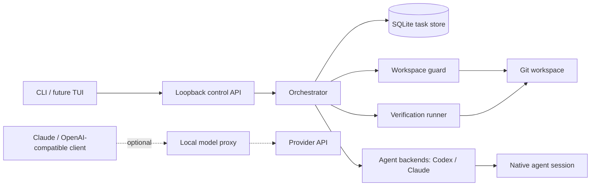

# IndexQube

**A local-first control plane for coding agents.**

IndexQube gives agent work a durable, permissioned, inspectable home. It keeps
the task alive across terminal exits, daemon restarts, and lost native sessions;
guards workspace writes; records approvals; reconciles what changed; and stores
verification evidence alongside the result.

[Website](https://indexqube.com) · [Product plan](./PLAN.md)

> **Alpha:** the control plane is usable from source, but release packaging and
> public installation are not ready. Treat the commands below as a contributor
> preview, not a stable installation contract.

## Why IndexQube

A coding agent session is useful runtime state, but it is a poor source of
truth. It can disappear, crash after changing files, or report a result that no
longer matches the workspace.

IndexQube owns the longer-lived record:

- the task and every turn;
- the selected backend and native-session lineage;
- explicit workspace-write permission;
- commands, changed paths, approvals, and cancellations;
- pre/post workspace snapshots and evidence mismatches;
- post-task verification checks and their output.

The operating rule is simple: **the agent is temporary; the task is not.**

## What works today

| Capability | Status |
|---|---|
| Durable task creation, listing, continuation, close, and reopen | Shipped foundation |
| Codex read-only and guarded workspace-write execution | Shipped foundation |
| SQLite task history and replayable/live task events | Shipped foundation |
| OS workspace locks, fencing epochs, and dirty-baseline reconciliation | Shipped foundation |
| Durable command/file approvals and retry-safe cancellation | Shipped foundation |
| Changed-file, command, route, snapshot, and session evidence | Shipped foundation |
| Configured recipes plus automatic Go, Node, Python, and Rust verification | Shipped foundation |
| Task-scoped security audit findings with severity and evidence | Shipped foundation |
| Claude Code read-only/write task execution and native-session continuation | Shipped foundation |
| Claude durable write approvals | Shipped foundation |
| Explicit Codex/Claude handoff with durable canonical packets | Shipped foundation |
| Durable per-task backend pin/unpin policy | Shipped foundation |
| Conservative pre-mutation backend failure classification | Shipped foundation |
| Durable ordered Codex/Claude fallback with restart recovery | Shipped foundation |
| Daemon-scoped authentication on every control endpoint and SSE stream | Shipped foundation |
| Attachable `iq ui` terminal experience | Shipped foundation |
| Authenticated workspace dashboard | Shipped foundation |
| Versioned task storage, retention, backups, and crash cleanup | Shipped foundation |
| Release installer | Planned |

The existing Claude/OpenAI-compatible local proxy remains available as an
optional data plane. The durable task control plane is the primary product.

## Try the control plane from source

Requirements:

- macOS or Linux;
- Go 1.25 or newer;
- Git;
- Codex CLI 0.149.x, installed and authenticated for real Codex tasks;
- Claude Code 2.1.x, installed and authenticated for real Claude tasks.

Those minor-version lines are the currently fixture-tested protocol contract.
IndexQube reports newer or older CLI lines as `incompatible` and will not run
them until their event protocol is covered by a checked-in fixture. This is a
deliberately fail-closed compatibility policy, not a claim that every other CLI
release is broken.

Build and start the loopback daemon:

```bash
git clone https://github.com/Revanth14/indexqube.git
cd indexqube
make build
./bin/iq doctor
./bin/iq
```

Bare `iq` starts the daemon when needed and opens the terminal UI. Its model proxy listens on
`127.0.0.1:17373`; its task control API listens separately on
`127.0.0.1:17374`.

Start typing requests. IndexQube picks the first compatible backend in a stable
Codex-then-Claude order; it never silently selects the fake test backend. Use
`/new write` when a task should be allowed to change the workspace:

```bash
/new write fix the failing retry test and verify it
```

The UI shows the current workspace's tasks and selected conversation alongside
backend health, pending approvals, changed files, commands, verification,
routes, and handoffs. Ctrl-N/Ctrl-P or the arrow keys change tasks. Plain text
starts a task when none is selected and continues an idle selected task.
`/new`, `/approve`, `/deny`, `/cancel`, `/handoff`, `/view`, and `/help` expose
the explicit control actions. Ctrl-C, Ctrl-D, `/detach`, and `/quit` only close
the UI; they never cancel a running task.

For a one-shot read-only task, positional text uses the same durable automatic
backend selection without opening the UI:

```bash
./bin/iq explain the retry and cancellation path
```

The former implicit Claude wrapper is now explicit as `iq claude`; existing
scripts should use that spelling when they intend to launch Claude Code through
the optional optimization proxy.

For a browser view of the same canonical workspace state:

```bash
./bin/iq dashboard
```

The CLI mints a one-minute, single-use browser ticket and exchanges it for an
HttpOnly, SameSite session scoped to the current daemon and workspace. The
daemon bearer credential is never placed in the URL or exposed to JavaScript.
Dashboard mutations require same-origin proof; restarting the daemon invalidates
all browser sessions. Use `iq dashboard --no-open` to print the one-time local
URL instead of launching a browser.

Create a read-only task in the current Git workspace:

```bash
./bin/iq task --backend codex "explain the retry and cancellation path"
```

Grant one task permission to modify the workspace:

```bash
./bin/iq task --backend codex --write \
  "harden cancellation, add regression coverage, and verify the result"
```

The Claude backend supports read-only repository work with a deliberately
restricted tool set:

```bash
./bin/iq task --backend claude "explain the workspace safety invariants"
```

Claude workspace-write tasks use the same explicit task grant, OS workspace
guard, durable approval state, and post-run reconciliation as Codex:

```bash
./bin/iq task --backend claude --write \
  "make the bounded change, run the relevant checks, and report the evidence"
```

IndexQube starts Claude in restricted mode, ignores user/project/local Claude
settings, loads only a private per-turn permission MCP server, and never uses a
permission-bypass flag. Claude can request shell and file-write tools, but each
operation blocks until its exact command or canonical in-workspace file target
has a durable `iq approve` or `iq deny` decision. Reads outside the workspace,
symlink escapes, unknown tools, and commands too large to review safely are
denied before execution.

Move an idle open task to another backend without losing canonical history:

```bash
./bin/iq handoff TASK_ID --to claude
./bin/iq handoff TASK_ID --to codex "review the remaining edge cases"
```

The handoff atomically pins the destination, creates a route attempt, and
stores the exact bounded JSON packet sent to the fresh destination-native
session. The packet includes the original goal, recent completed conversation,
current request, current workspace fingerprint/diff, authoritative changed
files, command summaries, latest verification result, and latest failure.
Handoffs are rejected while a task is active, awaiting approval, closed, or
`needs_attention`; inspect and explicitly reopen uncertain tasks first.

Pin an idle task to its current backend when future policy routing must not
move it automatically, or remove that constraint explicitly:

```bash
./bin/iq task pin TASK_ID
./bin/iq task unpin TASK_ID
./bin/iq task --backend codex --pin "keep this task on Codex"
```

Pinning never changes backends or starts a turn. Use `iq handoff` for a backend
change so the destination always receives canonical context. Handoffs pin their
destination atomically; pin/unpin requests are idempotent and rejected while a
task is running or awaiting approval.

Failed route attempts record a bounded backend-neutral failure class. A route
is marked fallback-eligible only for an allowlisted unavailable/rate-limit/lost-
session class, an unpinned task, and an exact unchanged pre/post workspace
fingerprint. IndexQube durably queues the other V1 backend only after persisting
that proof. The ordered policy never repeats a backend, never overrides a pin
or cancellation, and safely resumes a queued fallback after daemon restart.

IndexQube streams the run and prints the task ID. The durable record remains
available after the command exits:

```bash
./bin/iq tasks
./bin/iq task status TASK_ID
./bin/iq task show TASK_ID
./bin/iq continue TASK_ID "check the remaining edge cases"
./bin/iq handoff TASK_ID --to claude
```

Stop the daemon when finished:

```bash
./bin/iq stop
```

By default, state lives under `~/.indexqube`. Set `INDEXQUBE_HOME` to isolate
task history, logs, cache data, sessions, setup backups, and the local anonymous
machine identifier.

Task storage is explicitly schema-versioned and fails closed when an older
binary sees a newer database. IndexQube runs a SQLite integrity check before
opening existing state and writes a consistent owner-only snapshot before any
legacy migration. `iq backup [--output PATH]` creates the same consistent
snapshot on demand without overwriting an existing file.

Closed tasks expire after 30 days of inactivity; open, running,
awaiting-approval, and needs-attention tasks are never removed by retention.
The daemon applies retention at startup and every six hours. Backend events,
approval details, terminal errors, and verification output are centrally
secret-redacted and size-bounded before durable storage. Supervised agent
process groups carry an unguessable ownership token and are recorded in the
database, allowing a restarted daemon to terminate its own orphans without
risking an unrelated reused PID. Daemon logs retain a bounded count and age,
and oversized inactive logs retain only their most recent 8 MiB.

`iq doctor` checks state permissions, daemon/control health, database schema
and integrity, backups, lock/log/credential permissions, the installed Codex
and Claude protocol versions, optional proxy setup, and the opt-in telemetry
state.

### Control API authentication

The control API remains bound to numeric loopback and requires a daemon-scoped
bearer credential on every request, including `/control/healthz` and task event
streams. The daemon generates a new 256-bit credential on every start and
atomically stores it in `$INDEXQUBE_HOME/control-auth.json` with mode `0600`;
the state directory is enforced as `0700`. The CLI reads the credential from
that file and injects it as an HTTP header. It will only send the credential to
an `http://` origin using a numeric loopback address.

The credential is intentionally absent from `daemon.json`, logs, task evidence,
environment variables, and process arguments. Do not copy it into shell command
arguments or environment variables for manual API calls.

After upgrading from a build with an unauthenticated control API, stop the old
daemon and start it again with the new `iq` binary. The new CLI rejects a legacy
daemon that does not advertise the authenticated API contract, and old clients
receive `401 Unauthorized` from a new daemon.

## Permissions and approvals

`--write` is an explicit, up-front grant for that IndexQube task. The Codex
child still runs inside its workspace-write sandbox. Claude runs in restricted
mode with its file tools confined to the working directory and all shell/file
mutations routed through the durable permission bridge. Both run under
IndexQube's OS workspace lock and fencing epoch.

V1 deliberately allows one active writer per canonical Git workspace. A second
write task, continuation, or write handoff is rejected with `workspace_busy`
before a task or turn is created; when the holder belongs to the same daemon,
the response identifies its task and turn. Read-only tasks may run concurrently.
Parallel writers and worktree orchestration remain outside V1.

If the backend requests a command or file-change escalation, IndexQube first
commits the request to SQLite and moves the task to `awaiting_approval`. A user
can then make a durable decision:

```bash
./bin/iq approvals
./bin/iq approve APPROVAL_ID
./bin/iq deny APPROVAL_ID
```

The decision is stored before the backend resumes. Pending requests are
cancelled during daemon recovery and are never silently approved after a
restart.

Cancellation is also durable and safe to repeat:

```bash
./bin/iq cancel TASK_ID
./bin/iq task close TASK_ID
./bin/iq task reopen TASK_ID
```

A cancelled read-only turn returns to `open`. A write turn whose workspace
state cannot be proven safe becomes `needs_attention`. Reopening such a task is
an explicit acknowledgement, not a silent reset.

## Evidence and verification

`iq task show TASK_ID` assembles the task's canonical evidence from SQLite:
turns, backend sessions, route attempts, snapshots, normalized commands,
changed files, approvals, cancellations, verification runs, and the underlying
event timeline.

Changed-file evidence comes from per-path pre/post Git state, including edits
inside an already-dirty baseline. IndexQube compares that authoritative delta
with agent-reported file events. A mismatch is persisted and moves the task to
`needs_attention`.

After a successful write turn, IndexQube first looks for an explicit
`.indexqube/verification.json`. If no recipe exists, it conservatively detects
checks from the changed paths:

| Ecosystem | Detection | Command |
|---|---|---|
| Go | Nearest `go.mod` | `go test -mod=readonly ./...` |
| Node | Nearest `package.json` with a non-empty `test` script | `npm test`, `pnpm test`, `yarn test`, or `bun run test` |
| Python | Nearest project with an explicit pytest signal | `python3 -m pytest -p no:cacheprovider`, or the matching uv/Poetry/PDM runner |
| Rust | Nearest `Cargo.toml` | `cargo test --offline`, with `--locked` when a lockfile exists |

Dependency-manager offline controls are set for every automatic check. Rust
build output uses a temporary target directory, and Python bytecode and pytest
cache writes are disabled.

### Configured recipes

Use an argv array rather than a shell command string:

```json
{
  "version": 1,
  "checks": [
    {
      "name": "API tests",
      "kind": "test",
      "command": ["make", "test"],
      "cwd": "services/api",
      "paths": ["services/api"],
      "timeout_seconds": 180,
      "env": {
        "APP_ENV": "test"
      }
    }
  ]
}
```

Commit the recipe with the project before relying on it:

```bash
git add .indexqube/verification.json
git commit -m "Configure IndexQube verification"
```

Configured recipes are authoritative and replace auto-detection for that
workspace. `paths` entries are workspace-relative prefixes; omit `paths` to run
a check after every successful write turn. `kind` can be `test`, `lint`,
`typecheck`, `build`, `security`, or `custom`. Timeouts default to two minutes
and can be raised to ten minutes. The recipe must be Git-tracked before a turn
starts; IndexQube never executes an untracked recipe.

Recipe parsing is strict. Absolute executables, shell entry points, escaping or
symlinked working directories, protected environment overrides, oversized
commands, and unknown fields fail closed. If an agent creates, edits, deletes,
or renames the recipe during a turn, IndexQube records a configuration failure
instead of executing the new instructions. A reviewed workspace-relative
script can be invoked directly.

### Automatic security audit

Every successful write turn with authoritative changed paths also gets a
separate rule-based security check. IndexQube compares findings in its bounded
pre/post Git-diff evidence, so a finding already present in a dirty baseline is
not attributed to the turn merely because its line number moved. Changed
untracked files, which Git diffs do not contain, are scanned as bounded
current-file evidence and labeled clearly because their content may predate the
turn.

Findings are normalized into durable records with a stable rule ID, severity,
category, scope, path and line when available, redacted evidence, explanation,
and occurrence count. They appear in the control API and `iq task show` rather
than living only in a generated report.

The automatic policy is explicit:

- **high** severity fails verification and moves the task to
  `needs_attention`;
- **medium** and **low** severity produce `verified_with_warnings` while the
  task remains open;
- no findings produces a passed security check.

A truncated stored diff, an oversized file, a symlink, or another unscannable
changed untracked file becomes an audit-coverage warning. This scanner is local
heuristic triage, not proof that code is safe or exploitable; high findings
still require human review before commit or release.

Every executed check has bounded output, a bounded process group, and the
existing workspace lock. If verification changes tracked or unignored Git
workspace state, the run fails closed. A failed check preserves the agent's
completed turn but moves the task to `needs_attention`. When no project test
recipe or supported ecosystem matches, the durable security check still makes
clear what was reviewed rather than implying that tests ran.

Verification executes repository code. Offline package-manager settings prevent
implicit dependency downloads, but they are not a complete OS or network
sandbox; project tests and reviewed custom recipes retain the host access
available to their process. Git-ignored side effects are outside the current
workspace-stability comparison.

## Architecture



The control and data planes run in one local daemon today, but they have
separate responsibilities:

- **Control plane:** task state, execution, permissions, approvals, workspace
  safety, recovery, evidence, and verification.
- **Data plane:** provider traffic, prompt optimization, caching, streaming,
  auditing, and optional telemetry.

Official clients retain their own provider credentials. IndexQube does not
extract subscription tokens or persist provider credentials in task state.

## Optional proxy workflow

The proxy's deepest integration is currently Claude Code through Anthropic
Messages. OpenAI-compatible Responses ingress is also available for clients
that can select a local base URL.

```bash
./bin/iq setup claude
./bin/iq claude

./bin/iq setup codex
./bin/iq doctor
```

`iq setup` records backups before changing supported agent configuration, and
`iq unsetup` restores them. This proxy workflow is distinct from using Codex as
the durable `iq task` backend.

For a local security report from an explicitly captured Claude session:

```bash
./bin/iq claude --dump-payloads
./bin/iq audit latest
```

Payload dumping is opt-in. Reports are written locally under
`.indexqube/reports`.

## Development

The active build is Go-only:

```bash
make check       # formatting, vet, unit tests, and both binaries
make test-race   # race-enabled test suite
make build       # bin/iq and bin/indexqube-gateway
make control-smoke
```

Optional real-agent smoke lanes require the corresponding installed,
authenticated CLI. They are opt-in because they invoke the user's real agent
account:

```bash
IQ_SMOKE_REAL_CODEX_READ=1 make control-smoke
IQ_SMOKE_REAL_CODEX=1 make control-smoke
IQ_SMOKE_REAL_APPROVAL=1 make control-smoke
IQ_SMOKE_REAL_CLAUDE=1 make control-smoke
IQ_SMOKE_REAL_HANDOFF=1 make control-smoke
```

The deterministic suite always replays checked-in Codex CLI 0.149.1 and Claude
Code 2.1.252 protocol fixtures. The handoff lane performs a real read-only
Codex-to-Claude transition and checks the durable route and handoff evidence.

Repository map:

```text
gateway/cmd/iq/                    CLI and local daemon lifecycle
gateway/internal/control/          loopback control API
gateway/internal/orchestrator/     canonical task execution
gateway/internal/taskstore/        SQLite state and evidence
gateway/internal/workspace/        locks, fencing, and Git snapshots
gateway/internal/agent/            agent contracts and backends
gateway/internal/verification/     post-task verification
gateway/internal/securityaudit/    shared rule-based security scanner
gateway/internal/proxy/            optional model traffic data plane
web/                               indexqube.com
PLAN.md                            product gates and implementation order
```

## Next milestones

Work is currently focused on:

1. signed macOS/Linux release packaging and installer rollback;
2. local reliability metrics and opt-in anonymous reliability telemetry;
3. real-repository alpha feedback and broader CLI compatibility fixtures.

The acceptance gates and non-negotiable safety invariants live in
[PLAN.md](./PLAN.md).
