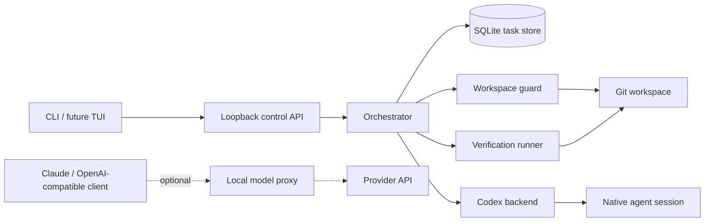

# IndexQube

**A local-first control plane for coding agents.**

IndexQube gives agent work a durable, permissioned, inspectable home. It keeps
the task alive across terminal exits, daemon restarts, and lost native sessions;
guards workspace writes; records approvals; reconciles what changed; and stores
verification evidence alongside the result.

[Website](https://indexqube.com) · [Product plan](./PLAN.md)

> **Alpha:** the control plane is usable from source, but release packaging and
> public installation are not ready. Treat the commands below as a contributor
> preview, not a stable installation contract.

## Why IndexQube

A coding agent session is useful runtime state, but it is a poor source of
truth. It can disappear, crash after changing files, or report a result that no
longer matches the workspace.

IndexQube owns the longer-lived record:

- the task and every turn;
- the selected backend and native-session lineage;
- explicit workspace-write permission;
- commands, changed paths, approvals, and cancellations;
- pre/post workspace snapshots and evidence mismatches;
- post-task verification checks and their output.

The operating rule is simple: **the agent is temporary; the task is not.**

## What works today

| Capability | Status |
|---|---|
| Durable task creation, listing, continuation, close, and reopen | Shipped foundation |
| Codex read-only and guarded workspace-write execution | Shipped foundation |
| SQLite task history and replayable/live task events | Shipped foundation |
| OS workspace locks, fencing epochs, and dirty-baseline reconciliation | Shipped foundation |
| Durable command/file approvals and retry-safe cancellation | Shipped foundation |
| Changed-file, command, route, snapshot, and session evidence | Shipped foundation |
| Automatic offline Go verification after successful write turns | Shipped foundation |
| Configured recipes and Node, Python, or Rust verification | Next |
| Claude Code as an orchestrated task backend and explicit handoff | Planned |
| TUI, authenticated control API, and release installer | Planned |

The existing Claude/OpenAI-compatible local proxy remains available as an
optional data plane. The durable task control plane is the primary product.

## Try the control plane from source

Requirements:

- macOS or Linux;
- Go 1.25 or newer;
- Git;
- the Codex CLI installed and authenticated for real Codex tasks.

Build and start the loopback daemon:

```bash
git clone https://github.com/Revanth14/indexqube.git
cd indexqube
make build
./bin/iq doctor
./bin/iq start
./bin/iq status
```

The daemon starts in the background. Its model proxy listens on
`127.0.0.1:17373`; its task control API listens separately on
`127.0.0.1:17374`.

Create a read-only task in the current Git workspace:

```bash
./bin/iq task --backend codex "explain the retry and cancellation path"
```

Grant one task permission to modify the workspace:

```bash
./bin/iq task --backend codex --write \
  "harden cancellation, add regression coverage, and verify the result"
```

IndexQube streams the run and prints the task ID. The durable record remains
available after the command exits:

```bash
./bin/iq tasks
./bin/iq task status TASK_ID
./bin/iq task show TASK_ID
./bin/iq continue TASK_ID "check the remaining edge cases"
```

Stop the daemon when finished:

```bash
./bin/iq stop
```

By default, state lives under `~/.indexqube`. Set `INDEXQUBE_HOME` to isolate
task history, logs, cache data, sessions, setup backups, and the local anonymous
machine identifier.

## Permissions and approvals

`--write` is an explicit, up-front grant for that IndexQube task. The Codex
child still runs inside its workspace-write sandbox and under IndexQube's OS
workspace lock and fencing epoch.

If the backend requests a command or file-change escalation, IndexQube first
commits the request to SQLite and moves the task to `awaiting_approval`. A user
can then make a durable decision:

```bash
./bin/iq approvals
./bin/iq approve APPROVAL_ID
./bin/iq deny APPROVAL_ID
```

The decision is stored before the backend resumes. Pending requests are
cancelled during daemon recovery and are never silently approved after a
restart.

Cancellation is also durable and safe to repeat:

```bash
./bin/iq cancel TASK_ID
./bin/iq task close TASK_ID
./bin/iq task reopen TASK_ID
```

A cancelled read-only turn returns to `open`. A write turn whose workspace
state cannot be proven safe becomes `needs_attention`. Reopening such a task is
an explicit acknowledgement, not a silent reset.

## Evidence and verification

`iq task show TASK_ID` assembles the task's canonical evidence from SQLite:
turns, backend sessions, route attempts, snapshots, normalized commands,
changed files, approvals, cancellations, verification runs, and the underlying
event timeline.

Changed-file evidence comes from per-path pre/post Git state, including edits
inside an already-dirty baseline. IndexQube compares that authoritative delta
with agent-reported file events. A mismatch is persisted and moves the task to
`needs_attention`.

For successful write turns that touch Go files or module metadata, IndexQube
finds the nearest `go.mod` and runs:

```bash
go test -mod=readonly ./...
```

The check runs with dependency downloads disabled, a two-minute timeout,
bounded output, and the existing workspace lock. If verification changes the
workspace, the run fails closed. A failed check preserves the agent's completed
turn but moves the task to `needs_attention`. Changes with no supported recipe
are recorded honestly as `verification_skipped`.

## Architecture



The control and data planes run in one local daemon today, but they have
separate responsibilities:

- **Control plane:** task state, execution, permissions, approvals, workspace
  safety, recovery, evidence, and verification.
- **Data plane:** provider traffic, prompt optimization, caching, streaming,
  auditing, and optional telemetry.

Official clients retain their own provider credentials. IndexQube does not
extract subscription tokens or persist provider credentials in task state.

## Optional proxy workflow

The proxy's deepest integration is currently Claude Code through Anthropic
Messages. OpenAI-compatible Responses ingress is also available for clients
that can select a local base URL.

```bash
./bin/iq setup claude
./bin/iq claude

./bin/iq setup codex
./bin/iq doctor
```

`iq setup` records backups before changing supported agent configuration, and
`iq unsetup` restores them. This proxy workflow is distinct from using Codex as
the durable `iq task` backend.

For a local security report from an explicitly captured Claude session:

```bash
./bin/iq claude --dump-payloads
./bin/iq audit latest
```

Payload dumping is opt-in. Reports are written locally under
`.indexqube/reports`.

## Development

The active build is Go-only:

```bash
make check       # formatting, vet, unit tests, and both binaries
make test-race   # race-enabled test suite
make build       # bin/iq and bin/indexqube-gateway
make control-smoke
```

Optional real-agent smoke lanes require an installed, authenticated Codex CLI:

```bash
IQ_SMOKE_REAL_CODEX=1 make control-smoke
IQ_SMOKE_REAL_APPROVAL=1 make control-smoke
```

Repository map:

```text
gateway/cmd/iq/                    CLI and local daemon lifecycle
gateway/internal/control/          loopback control API
gateway/internal/orchestrator/     canonical task execution
gateway/internal/taskstore/        SQLite state and evidence
gateway/internal/workspace/        locks, fencing, and Git snapshots
gateway/internal/agent/            agent contracts and backends
gateway/internal/verification/     post-task verification
gateway/internal/proxy/            optional model traffic data plane
web/                               indexqube.com
PLAN.md                            product gates and implementation order
```

## Next milestones

Work is currently focused on:

1. configurable verification recipes and additional ecosystems;
2. control API authentication;
3. Claude Code task execution and deterministic handoff;
4. an attachable local TUI;
5. signed release packaging and real-repository alpha feedback.

The acceptance gates and non-negotiable safety invariants live in
[PLAN.md](./PLAN.md).
